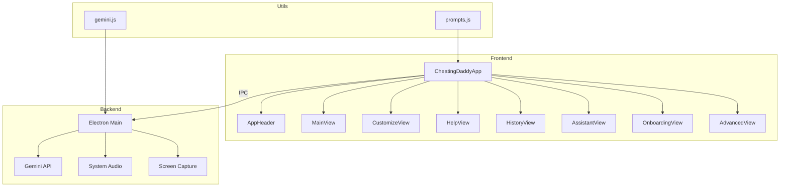

```mermaid
graph TD
    subgraph Frontend
        A[CheatingDaddyApp] --> B[AppHeader];
        A --> C[MainView];
        A --> D[CustomizeView];
        A --> E[HelpView];
        A --> F[HistoryView];
        A --> G[AssistantView];
        A --> H[OnboardingView];
        A --> I[AdvancedView];
    end

    subgraph Backend
        J[Electron Main] --> K[Gemini API];
        J --> L[System Audio];
        J --> M[Screen Capture];
    end

    subgraph Utils
        N[prompts.js] --> A;
        O[gemini.js] --> J;
    end

    A -- IPC --> J;
```
